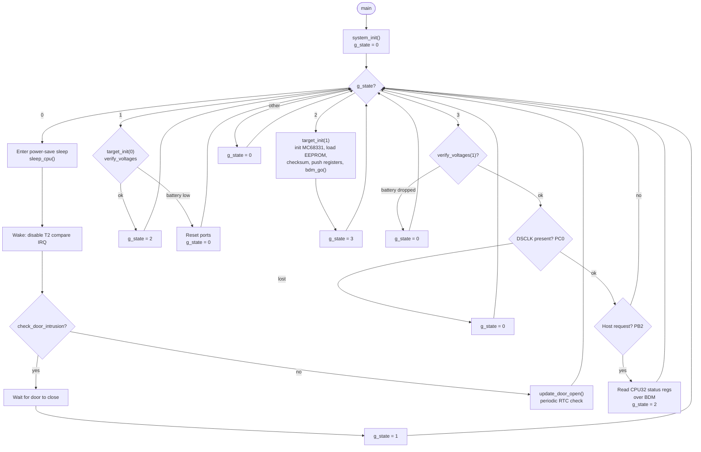

# db-firmware

AVR firmware for the DB1MB redesign. The ATmega host sleeps in power-save mode,
wakes on a door-intrusion event, brings up an MC68331 target over BDM, and then
monitors it while it runs.

## Main loop state machine

The `main()` function in [`src/main.c`](src/main.c) is a four-state machine
driven by the global `g_state`.

## States

| `g_state` | Purpose |
|-----------|---------|
| 0 | Power-save sleep; wake on door intrusion or do a periodic RTC check |
| 1 | Battery gate — `target_init(0)` verifies voltages before bring-up |
| 2 | Full MC68331 bring-up over BDM (init, EEPROM load, checksum, resume) |
| 3 | Runtime monitor — watch battery, DSCLK, and host requests |
